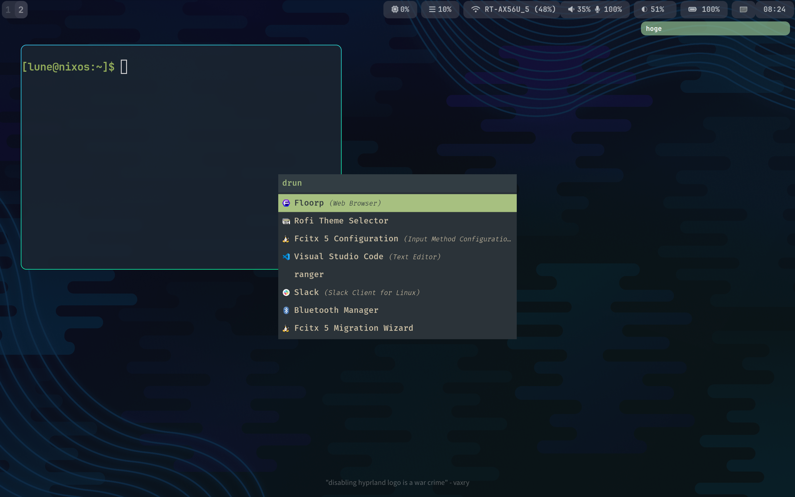

# lune's dotfile

## Overview

- NixOS + Hyprland 🚂
- Wallpaper:    swww
- Launcher:     rofi-wayland
- Bar:          waybar
- Notification: mako
- Editor:       lunarvim / vscode
- Machine:      GPD WIN MAX2 2024
- No evaluation warning confirmed (24/11/04)

## How to use

tested on my machine (24/11/04)

0. Install nixos (w/ GUI) to your pc and launch it
1. Copy/Clone this repository
2. Make sure that there are no hardware-configuration.nix in .dotfiles/system/nixos !!!
3. sudo cp -r ~/.dotfiles/system/* /etc/nixos/
4. cp -r ~/.dotfiles/home-manager ~/.config/
5. cd /etc/nixos | sudo nixos-rebuild switch --flake ./#WM2
6. cd | home-manager switch

## Note

- flake is used to control configuration.nix and related files.
- .dotfiles/home-manager/modules/hypr.nix use Pictures/w3.jpg, so please change it as you like it.
- home-manager is used for user-specific programs (desktop, editor, terminal)
- hypr, mako, waybar, alacritty config files are automatically generated by home-manager.
- rofi theme and lunarvim config files are not generated automatically.

## Special thanks

Andrey0189 (github): modularized .nix files

Vimjoyer (youtube): general discription of nixos and nix
